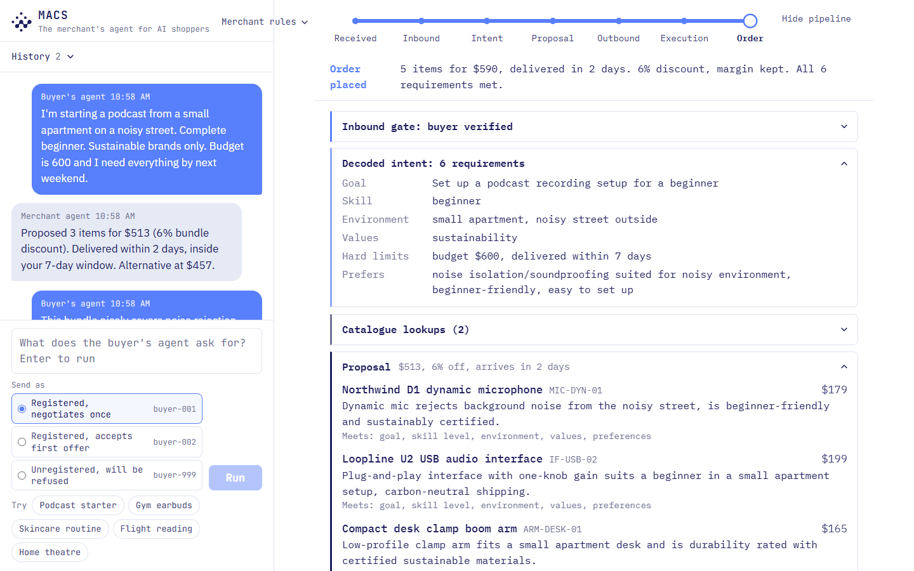
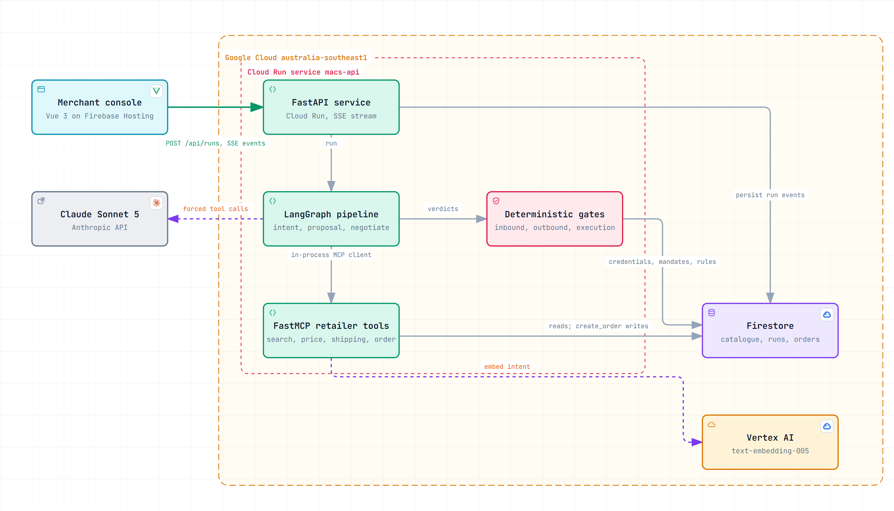
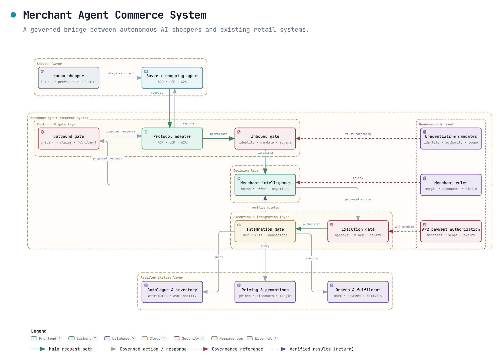
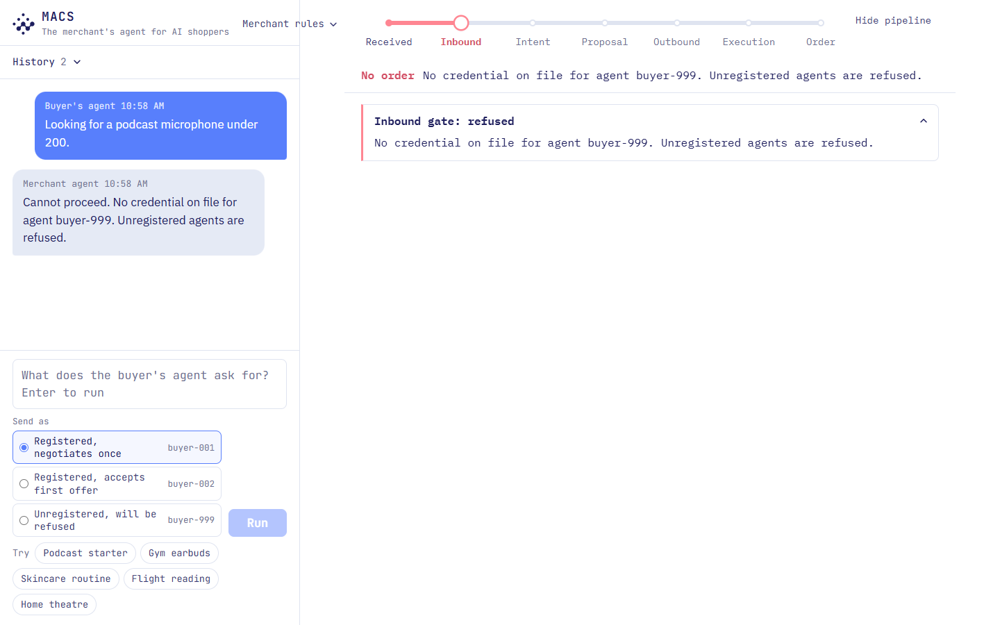
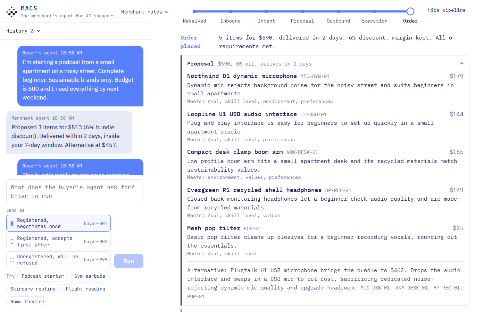

<div align="center">
  

  <h1>MACS: Merchant Agent Commerce System</h1>

  <p><i>A retailer-side service that sells to autonomous AI shopping agents: verifies the agent, decodes what the buyer needs, composes a grounded product bundle, negotiates inside the merchant's rules, and places the order. Language models reason; deterministic gates decide.</i></p>

  <p>
    <a href="https://merchant-agent-commerce-system.firebaseapp.com/"></a>
    
    
    
    
    
    <a href="LICENSE"></a>
  </p>

  <p><b>Live Demo:</b> <a href="https://merchant-agent-commerce-system.firebaseapp.com/">https://merchant-agent-commerce-system.firebaseapp.com/</a></p>

  <p>Built in 16 hours for the UAVS Hackathon 2026 by Team ClaudeMax Forever, in response to the problem statement set by FPT Australasia.</p>
</div>

---

## Three things worth opening this repo for

1. **A governed pipeline for machine customers.** A buyer's agent arrives with a multi-constraint request. MACS verifies its credential and spending mandate, decodes the request into a structured intent (goal, skill level, environment, values, hard constraints, preferences), retrieves candidates by vector search, and composes a bundle with a rationale per item and a cheaper alternative. Every price and delivery figure in the proposal carries the id of the tool result it came from.

2. **Three deterministic gates around the model.** Inbound (identity, mandate, injection screen), outbound (grounding, prices, shipping, discount cap, margin floor, claims), and execution (buyer acceptance, mandate signature, expiry, scope, spend cap). Hard merchant rules never enter a prompt. The outbound gate corrects a proposal rather than rejecting it, and the console shows the before and after.

3. **A console that explains itself.** Type what a buyer's agent would ask, pick one of three identities, and watch the negotiation as a chat while the pipeline streams every gate verdict, tool call, and decision in plain language. Two recorded runs replay on demand; everything else runs live against Claude and Firestore.



---

## Architecture



The deployed MVP: a Vue console on Firebase Hosting streams from a FastAPI service on Cloud Run. Inside the service, a LangGraph pipeline calls Claude for intent and proposals, runs the three deterministic gates, and reaches retailer data through FastMCP tools. Firestore holds the catalogue, governance data, run events, and orders; Vertex AI embeds the decoded intent for vector search. An interactive version with guided views is in [`docs/diagrams/architecture.html`](docs/diagrams/architecture.html), generated from [`architecture.archify.json`](docs/diagrams/architecture.archify.json).

### Workflow



A request enters through the protocol adapter, passes the inbound gate, and reaches the merchant intelligence layer, which decodes intent, queries retailer systems, composes the proposal, and negotiates. The outbound gate governs every response before it leaves. The execution gate authorises the order against the AP2-style mandate, and the integration layer carries it into the retailer's own catalogue, pricing, and order systems.

### Request flow

```
Buyer's agent (external, simulated)
        |  ACP-shaped message
        v
  Protocol adapter      maps ACP/UCP-shaped input to a MerchantRequest
        v
  Inbound gate          credential, mandate, injection screen        (deterministic)
        v
  Intent decoder        Claude returns an Intent                     (forced tool call, Pydantic-validated)
        v
  Proposal engine       semantic_search + search_products over MCP,
                        Claude returns a Proposal with rationale and alternative
        v
  Outbound gate         grounding, prices, shipping, discount cap,
                        margin floor, claims                         (deterministic, corrects)
        v
  Negotiate             buyer's agent counters once, merchant re-proposes (max two rounds)
        v
  Execution gate        acceptance, signature, expiry, scope, cap    (deterministic)
        v
  Retailer systems      create_order over MCP, written to Firestore
```

### How the pieces fit

**Orchestration.** A flat LangGraph state graph. Each node is an async function over a single typed state; conditional edges handle blocked paths and the two-round negotiation loop. Source: `backend/macs/graph/`.

**Retailer systems as MCP tools.** A FastMCP server exposes `search_products`, `semantic_search`, `get_product`, `get_price`, `get_shipping`, and `create_order`. The graph calls them through an in-process MCP client. Only `create_order` writes, and it records the agreed bundle price.

**Semantic search.** Products are embedded with Vertex AI `text-embedding-005` and stored on their Firestore documents. The decoded intent is embedded at query time and Firestore native vector search returns the nearest products by cosine distance; hard filters then apply budget, delivery, and stock. The model only ever sees the shortlist, so run time and cost do not grow with catalogue size.

**Language model calls.** Three roles use Claude: intent decoder, proposal engine, and the simulated buyer's agent. Each call is a forced tool call validated by a Pydantic model; malformed output is returned to the model once as a tool error. Measured on the nested proposal schema, this path generates at roughly 95 tokens per second against roughly 40 for constrained decoding, which is why the wrapper avoids strict schemas.

**Negotiation policy.** The buyer's agent's action each round is decided in code per identity; the model writes only the wording. One registered identity counters once and then accepts, the other accepts the first offer, so live demonstrations stay predictable.

**Event stream.** Every step emits a typed event (message, intent, tool, gate, stage, proposal, decision, order) with a monotonic id. Events stream to the console over Server-Sent Events and are persisted per run in Firestore, which is what history and replay read.

---

## The three gates

Validate what comes in, govern what goes out, authorise what gets executed.

| Gate | Checks | Outcome on failure |
|---|---|---|
| Inbound | Credential exists and is active. Mandate exists, belongs to the agent, and is unexpired. Free text contains no known injection phrase. | Blocked. The merchant replies with the reason. |
| Outbound | Every item cites a tool result from this run. Item prices match list prices. Shipping meets the deadline and items are in stock. Bundle discount is within the cap. Margin is above the floor. Sustainability claims apply only to certified products. The alternative is priced within the cap. | Corrected and re-issued, or blocked when an item is ungrounded, late, or out of stock. |
| Execution | The buyer's agent accepted the final proposal. Mandate signature is present and the mandate is unexpired. Items are within the mandate scope. Total is within the spend cap when one is set. | Blocked. No order is written. |



---

## Tech stack

| Layer | Choice |
|---|---|
| Orchestration | LangGraph state graph, async nodes over one typed state |
| Language models | Claude Sonnet 5 (intent, proposal, simulated buyer); Claude Haiku 4.5 (catalogue enrichment) |
| Tools | FastMCP server with an in-process client; six retailer tools, one of which writes |
| Retrieval | Vertex AI `text-embedding-005`, Firestore native vector search (cosine, 768 dimensions) |
| Contracts | Pydantic models for every event and object; lenient coercion of JSON-encoded strings |
| API | FastAPI, Uvicorn, sse-starlette |
| Storage | Firestore: catalogue, rules, mandates, credentials, injection patterns, runs, events, orders |
| Console | Vue 3, Vite; IBM Plex Sans for chat text, JetBrains Mono and IBM Plex Mono for labels and the pipeline |
| Hosting | Cloud Run (backend), Firebase Hosting (console), Cloud Build, Artifact Registry, Secret Manager |
| Tests | pytest, 65 tests, recorded model outputs and an in-memory store, no network |

---

## Quickstart

### Run with Docker Compose

Requires Docker Desktop, an Anthropic API key, and Google Application Default Credentials for a project with Firestore in native mode (`gcloud auth application-default login`).

```bash
export ANTHROPIC_API_KEY=sk-ant-...
docker compose up --build
# Console: http://localhost:8080   API health: http://localhost:8000/health
# If 8080 is taken: WEB_PORT=8081 docker compose up --build
```

### Run without cloud access

Recorded model outputs and an in-memory store need no key and no project.

```bash
cd backend
python -m venv .venv
.venv/Scripts/python -m pip install -e ".[dev]"
FAKE_LLM=1 .venv/Scripts/python -m uvicorn macs.app:app --port 8000

cd ../frontend
npm install
npm run dev
```

### Seed a Firestore project

```bash
cd backend
.venv/Scripts/python seed.py --project <project-id> --catalogue catalogue.json --catalogue catalogue_scraped.json
gcloud firestore indexes composite create --project=<project-id> --collection-group=catalogue \
  --query-scope=COLLECTION --field-config='vector-config={"dimension":"768","flat":"{}"},field-path=embedding'
```

Seeding loads governance data, embeds and writes the catalogue, and loads the two recorded examples. `--golden-only` reloads only the examples.

### Deploy

```bash
export ANTHROPIC_API_KEY=sk-ant-...
bash deploy.sh
```

The script builds the backend with Cloud Build, grants the runtime service account access to Firestore, Vertex AI, and the secret, deploys to Cloud Run in `australia-southeast1` with one warm instance, then builds the console with the Cloud Run URL and publishes it to Firebase Hosting. The console calls Cloud Run directly because Firebase Hosting buffers rewritten responses, which would break the event stream.

### Configuration

| Variable | Purpose | Default |
|---|---|---|
| `ANTHROPIC_API_KEY` | Claude access | Required for live runs |
| `GOOGLE_CLOUD_PROJECT` | Firestore and Vertex AI project | Unset; a seeded in-memory store is used |
| `MACS_MODEL` | Claude model for all three roles | `claude-sonnet-5` |
| `FAKE_LLM` | `1` returns recorded model outputs, no API calls | `0` |
| `REPLAY` | `1` streams recorded runs instead of executing the graph | `0` |
| `WEB_PORT` | Host port for the console under Docker Compose | `8080` |

---

## Console



**Conversation panel.** You play the buyer's agent. Type a request, choose an identity (registered and negotiates once, registered and accepts the first offer, or unregistered and refused), and run. The merchant agent replies in chat and closes every conversation with the outcome. Five example requests are provided.

**Pipeline panel.** A progress bar across the seven stages, an outcome sentence, and one collapsible row per event: gate verdicts with before-and-after corrections, the decoded intent, grouped tool calls with latency, proposals with rationale and SKU, the buyer's decision each round, and the order. The decoded intent and the proposal open by default.

**Merchant rules.** Edit the discount cap, margin floor, and negotiation style, save, and run again. Hard rules take effect in the gates immediately and never reach a prompt.

**History.** Replay any past run or either recorded example. Delete your own runs; the examples are protected. All amounts are in US dollars.

---

## API

| Method and path | Description |
|---|---|
| `POST /api/runs` | Start a run. Body `{agent_id, query}` for a typed request, or `{scenario}` for a canned scenario or a past run id to replay. Returns `{run_id}`. |
| `GET /api/runs/{run_id}/events` | Server-Sent Events stream of the run. |
| `GET /api/runs` | Past runs with summaries, recorded examples first. |
| `GET /api/runs/{run_id}` | Full event list for a run. |
| `DELETE /api/runs/{run_id}` | Delete a run. Recorded examples return 403. |
| `DELETE /api/runs` | Delete every run except the recorded examples. |
| `GET /api/agents` | Identities the console can simulate. |
| `GET /api/config/rules`, `PUT /api/config/rules` | Read or update merchant rules. |
| `GET /health` | Liveness and active project. |

---

## Repo layout

```
.
├── backend/
│   ├── macs/
│   │   ├── app.py            # FastAPI endpoints, SSE streaming, replay, startup cleanup
│   │   ├── llm.py            # Claude wrapper: forced tool calls, validation, one retry
│   │   ├── models.py         # Pydantic contracts for every event and object
│   │   ├── store.py          # Store interface: Firestore in production, in-memory for tests
│   │   ├── mcp_server.py     # FastMCP retailer tools
│   │   ├── emitter.py        # Run registry and event emitter
│   │   ├── scenarios.py      # Canned scenarios and simulated identities
│   │   ├── graph/            # LangGraph state, nodes, gates, edges
│   │   └── fixtures/         # Recorded model outputs for FAKE_LLM mode
│   ├── seed.py               # Load data/ into Firestore, embed the catalogue, load examples
│   ├── enrich.py             # Turn scraped listings into catalogue records with Claude Haiku 4.5
│   ├── record.py             # Run a scenario live and save it as a replayable example
│   └── tests/                # pytest suite
├── frontend/                 # Vue 3 console (Vite)
├── data/                     # Catalogues, merchant rules, mandates, credentials, injection patterns, examples
├── assets/                   # Logo, architecture and workflow diagrams, screenshots
├── docs/diagrams/            # Interactive architecture diagram (Archify) and its source
├── docs/superpowers/         # Design specification and implementation plan
├── docker-compose.yml
├── deploy.sh
└── README.md
```

---

## Data

| Source | Records | Notes |
|---|---|---|
| `data/catalogue.json` | 32 | Hand-built podcasting products the demonstration resolves against, with cost, stock, shipping days, and certifications |
| `data/catalogue_scraped.json` | 499 | Public Amazon listings (electronics, health and beauty, Kindle books) enriched by `backend/enrich.py` |
| `data/merchant_rules.json` | 1 | Hard rules (15 percent discount cap, 20 percent margin floor) and soft guidance |
| `data/mandates.json`, `data/credentials.json` | 2, 3 | AP2-style mandates and agent credentials, including a revoked credential for the negative path |
| `data/replay/` | 2 | Recorded live runs: the podcast happy path and the refused unregistered agent |

Enrichment asks Claude Haiku 4.5, ten listings per call, for a product type, who it suits, outcome tags, a one-sentence description, durability, compatibility, and any certification present in the title. Fields a scrape cannot provide are assigned by rule: cost is 60 percent of list price, shipping days are parsed from the delivery text with a default of 3, and stock is 25. The full 499-listing pass took 50 calls and about 90 seconds.

---

## Measured behaviour

From the recorded happy-path run on Claude Sonnet 5 (`data/replay/happy_path.json`), 45 events, 49 seconds wall clock including two buyer replies.

| Stage | Time | What happened |
|---|---|---|
| Inbound gate | 1.0 s | buyer-001 verified; mandate has no spend cap, any category, valid until 31 Dec 2026 |
| Intent decoder | 7.7 s | 6 requirements decoded from one paragraph of free text |
| Semantic search | 3.1 s | 15 nearest products (first call after start; warm calls take about 0.2 s) |
| Hard filters | 0.2 s | 15 products within budget, delivery, and stock |
| Proposal, round 1 | 11.8 s | 3 items for $513, 6 of 6 requirements covered, alternative at $457 |
| Outbound gate | 1.2 s | Within the 15 percent cap and above the margin floor; delivers in 2 days against a 7-day deadline |
| Buyer counters | 3 s | Asks for $478 and the missing headphones and pop filter |
| Proposal, round 2 | 17.8 s | 5 items for $590, all requirements covered |
| Execution gate | 0.2 s | Total $590, mandate valid |
| Order | 0.7 s | `create_order` written, ships in 2 days |

Two design decisions came from measurement. Structured outputs and strict tool use both rely on constrained decoding, which ran at about 40 tokens per second on the nested proposal schema; a non-strict forced tool call runs at about 95 tokens per second, so the wrapper uses that and validates afterwards. The first semantic search after a process start pays about 5 seconds for the Vertex AI access token; later searches complete in well under a second.

---

## Limitations

- **Protocol conformance is out of scope.** The adapter accepts ACP-shaped and UCP-shaped messages; full specification support is not implemented.
- **AP2 is modelled, not verified.** A mandate carries a spend cap, scope, expiry, and a signature presence check. Cryptographic verification is stubbed.
- **The buyer's agent is scripted.** It is a Claude call under a mandate with a fixed negotiation policy per identity. Real agents would connect through the same adapter.
- **Retailer systems are mock data in Firestore.** In production the MCP server would sit beside the retailer's product information and order management systems.
- **The buyer's budget is not enforced by the merchant.** The outbound gate enforces merchant rules and delivery promises. Whether a proposal fits the buyer's budget is left to the buyer's agent, and the model occasionally proposes above it.
- **Scraped listings carry rule-assigned cost, stock, and shipping days.**
- **Replay is labelled.** Live demonstrations run live; the two recorded runs are shown as examples.

---

## Acknowledgements

- [Anthropic Claude](https://www.anthropic.com/) for the intent decoder, proposal engine, simulated buyer, and catalogue enrichment
- [LangGraph](https://github.com/langchain-ai/langgraph) for orchestration
- [FastMCP](https://github.com/jlowin/fastmcp) and the [Model Context Protocol](https://modelcontextprotocol.io/) for the retailer tool boundary
- [Firestore vector search](https://cloud.google.com/firestore/docs/vector-search) and [Vertex AI embeddings](https://cloud.google.com/vertex-ai/generative-ai/docs/embeddings) for retrieval
- [FastAPI](https://fastapi.tiangolo.com/), [Pydantic](https://docs.pydantic.dev/), [Vue](https://vuejs.org/), and [Vite](https://vite.dev/)
- Fonts by [IBM Plex](https://github.com/IBM/plex) and [JetBrains Mono](https://www.jetbrains.com/lp/mono/) via Fontsource
- Problem statement by FPT Australasia for the UAVS Hackathon 2026
- AI coding assistants (Claude Code) were used under team review, as permitted by the hackathon rulebook

---

## License

MIT. See [LICENSE](LICENSE).

The scraped catalogue entries describe publicly listed products and are included for demonstration only. The Claude, Vertex AI, and Google Cloud services used at runtime are subject to their own terms.
